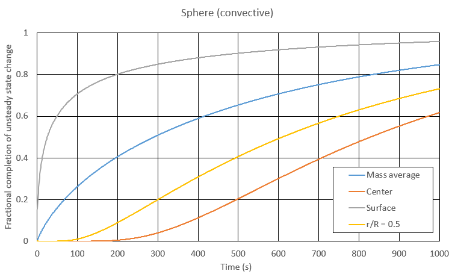
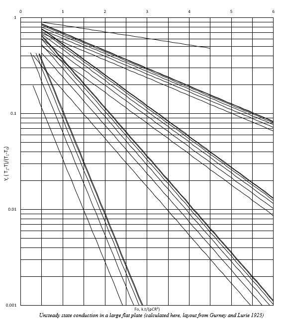

# Excel Implementation of Crank's Analytical Solutions for Transient Heat Conduction

## Download

- CrankSolutions.xlsx

## Overview

This workbook implements a selection of the analytical transient heat conduction solutions presented in:

> Crank, J. *The Mathematics of Diffusion*, 2nd Edition.

The workbook provides analytical solutions for transient temperature distributions in:

- Infinite Slabs
- Infinite Cylinders
- Spheres

for both:

- First-Type (Constant Surface Temperature) Boundary Conditions
- Third-Type (Convective Surface) Boundary Conditions

The implementation is intended to provide engineers, researchers, educators, and students with direct access to the classical analytical solutions using only native Microsoft Excel formulas.

No external software, numerical PDE solvers, or finite-difference methods are required.

---

# Features

- Analytical solutions from Crank's *Mathematics of Diffusion*
- Slab geometry
- Cylinder geometry
- Sphere geometry
- First boundary condition (constant surface temperature)
- Third boundary condition (convective boundary)
- Gurney-Lurie chart generation
- Automatic eigenvalue calculation
- Arbitrary number of series terms
- Dynamic-array implementation
- No manual Solver operations required
- Example charts and validation cases included

---

# Workbook Structure

| Sheet | Purpose |
|---------|---------|
| Home | Workbook overview and navigation |
| Full formula | native formuala examples of Cranks general solutions |
| Eigen Value validation | Eigenvalue equations and roots |
| Terms needed validation | Illustration of terms converging to solution |
| References | Source references and bibliography |
| Slab 1st Boundary | Constant surface temperature slab solution |
| Slab 3rd Boundary | Convective slab solution |
| Cylinder 1st Boundary | Constant surface temperature cylinder solution |
| Cylinder 3rd Boundary | Convective cylinder solution |
| Sphere 1st Boundary | Constant surface temperature sphere solution |
| Sphere 3rd Boundary | Convective sphere solution |
| Gurney and Lurie | Classical chart representation |
| FZERO_BISECT | Documentation of root-finding function |
---

# Example usage for a sphere, 3rd type (convective) boundary condition



---

# Governing Equation

The workbook impliments a selection of Cranks solutions to the transient conduction equation:

```math
\frac{\partial T}{\partial t}
=
\alpha \nabla^2 T
```

where:

| Symbol | Description |
|----------|----------|
| T | Temperature |
| t | Time |
| α | Thermal diffusivity |

These analytical solutions assume:

- Constant thermal properties
- Uniform initial temperature
- Homogeneous material
- Isotropic material properties
- No internal heat generation
- One-dimensional conduction
- Constant or convective boundary conditions

---

# Dimensionless Groups

## Dimensionless Temperature

```math
Y
=
\frac{T-T_{\infty}}
     {T_i-T_{\infty}}
```

where:

- \(T\) = temperature
- \(T_i\) = initial temperature
- \(T_{\infty}\) = surrounding fluid temperature

---

## Fourier Number

```math
Fo
=
\frac{\alpha t}{L_c^2}
```

where:

- \(\alpha\) = thermal diffusivity (m²/s)
- \(t\) = time (s)
- \(L_c\) = characteristic length (m)

The Fourier number measures the degree of thermal penetration into a body.

---

## Biot Number

```math
Bi
=
\frac{hL_c}{k}
```

where:

- \(h\) = heat transfer coefficient (W/m²K)
- \(L_c\) = characteristic length (m)
- \(k\) = thermal conductivity (W/mK)

The Biot number describes the ratio of:

```math
\frac{\text{internal conduction resistance}}
     {\text{surface convection resistance}}
```

---

# Boundary Conditions

## First-Type Boundary Condition

The surface temperature is maintained at a fixed value:

```math
T_s = T_{\infty}
```

This idealised condition represents perfect thermal contact with an infinite thermal reservoir.

---

## Third-Type Boundary Condition

Heat transfer occurs through convection at the surface:

```math
-k\frac{\partial T}{\partial n}
=
h(T_s-T_{\infty})
```

This condition is commonly encountered in:

- Air cooling
- Air heating
- Water chilling
- Food processing
- Retorts
- Heat treatment

---

# Eigenvalue Equations

The convective boundary condition requires solution of geometry-specific transcendental equations.
Eigen value functions are either presented inline using LET as EIGEN, or used as named functions being BETA_SLAB, BETA_CYLINDER, or BETA_SPHERE respectively

---

## Slab

```math
\beta\tan\beta
=
Bi
```

---

## Sphere

```math
1-\beta\cot\beta
=
Bi
```

---

## Cylinder

```math
\beta J_1(\beta)-Bi\,J_0(\beta)=0
```

where:

- \(J<sub>0</sub>\) = Bessel function of the first kind, order zero
- \(J<sub>1</sub>\) = Bessel function of the first kind, order one

---

# Numerical Implementation

The analytical solutions require evaluation of:

1. Eigenvalues
2. Coefficients
3. Infinite series

Excel 365 dynamic-array functionality allows these operations to be performed using standard worksheet formulas.

---

## MAP()

`MAP()` is used to evaluate arbitrary numbers of eigenvalues and series terms.

Example concept:

```excel
MAP(
    SEQUENCE(1,N),
    LAMBDA(n,...)
)
```

This allows the series length to be altered simply by changing the number of terms.

---

## LET()

`LET()` is used extensively to:

- Improve readability
- Reduce duplicated calculations
- Expose the mathematical structure of the equations

Example:

```excel
=LET(
  R,$B$5,
  D,$B$6,
  t,$B$3,
  Fo,D*t/(R^2),
  Fo
)
```

which directly represents:

```math
Fo=\frac{Dt}{R^2}
```

---

## LAMBDA()

`LAMBDA()` allows reusable mathematical functions to be defined directly within worksheet formulas.

This enables:

- Eigenvalue equations
- Series evaluations
- Root-finding procedures

without requiring VBA.

---

# Root Finding

The worksheet uses a custom function:
Either listed by LET as BISECT or added as a nammed function FZERO_BISECT
```text
FZERO_BISECT()
```

to determine eigenvalues.

The function implements the classical bisection method.

---

## Function Signature

```text
FZERO_BISECT(
    f,
    lo,
    hi,
    Niter
)
```

where:

- `f` = function to evaluate
- `lo` = lower bracket
- `hi` = upper bracket
- `Niter` = number of bisection iterations

---

## Why Bisection?

The eigenvalue equations possess:

- Isolated roots
- Known intervals
- Continuous behaviour within those intervals

making bisection:

- Robust
- Predictable
- Guaranteed to converge

for the use cases presented in this workbook.

---

# Gurney-Lurie Charts

The workbook includes implementations of the classical Gurney-Lurie representations for:

- Slabs
- Cylinders
- Spheres

These charts historically provided graphical approximations of transient conduction solutions before computer-based calculations became widely available.
It is left as an excersize for the user to evaluate how close the presented implementation of Gurney-Lurie charts match the published ones.




---

# Intended Applications

Potential applications include:

- Food heating
- Food cooling
- Pasteurisation studies
- Retort analysis
- Process engineering
- Thermal property investigations
- Engineering education
- Heat-transfer teaching
- Validation of numerical models
- Comparison with Gurney-Lurie charts

---

# Requirements

- Microsoft Excel 365
- Dynamic Arrays
- MAP()
- LET()
- LAMBDA()

Older Excel versions may not support all functions required by the workbook.

---
# Dependencies

Eigenvalues are determined using the
[Native excel root finding gist](https://gist.github.com/mrpurplenz/72d605884ac01b09f96c5b06d4f5d09f)
root-finding function.

# References

Crank, J. (1975). *The Mathematics of Diffusion*. 2nd Edition.

Carslaw, H.S., & Jaeger, J.C. *Conduction of Heat in Solids*. 2nd Edition.

Heisler, M.P. (1947). *Temperature Charts for Induction and Constant Temperature Heating*.

Gurney, K., & Lurie, A. *Graphical Solutions of Transient Heat Conduction Problems*.

Incropera, F.P., DeWitt, D.P., Bergman, T.L., & Lavine, A.S. *Fundamentals of Heat and Mass Transfer*.

---

# Author

Richard Edmonds

Bioprocess Engineer

New Zealand

---

# License

Specify your preferred licence here.

Examples:

- MIT License
- Creative Commons Attribution (CC BY 4.0)
- Creative Commons Attribution-ShareAlike (CC BY-SA 4.0)

---

# Acknowledgements

This workbook exists because of the foundational work of:

- J. Crank
- H.S. Carslaw
- J.C. Jaeger
- M.P. Heisler
- K. Gurney
- A. Lurie

whose analytical developments continue to provide elegant solutions to transient heat conduction problems nearly a century later.
